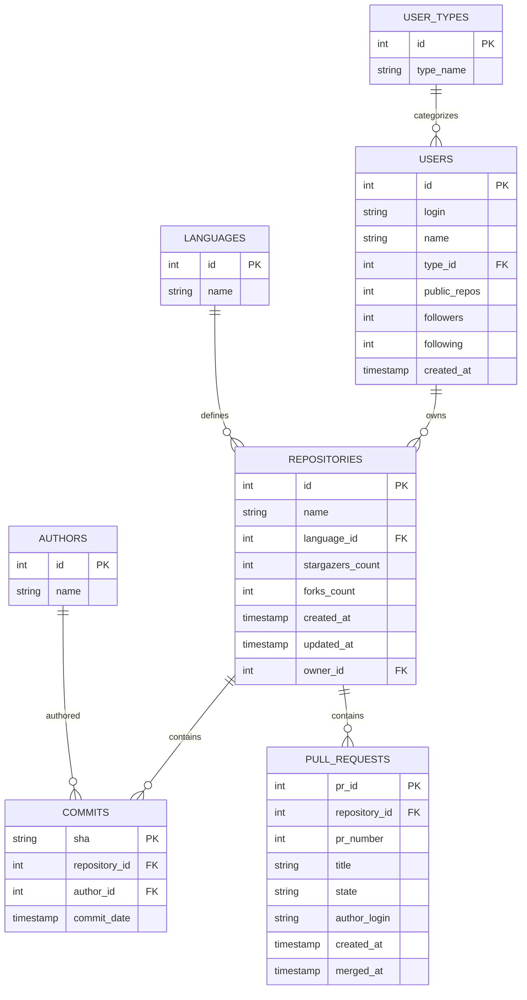

# 🎓 GitHub Students Insights

An end-to-end **Data Engineering & AI pipeline** that extracts GitHub activity data, loads it into **Snowflake**, and applies **Machine Learning models** to help academic mentors monitor student project progress — with final analytics delivered via **Power BI**.

---

## 🏗 Architecture

```
GitHub API  →  Extract (Python)  →  CSVs  →  Snowflake  →  Power BI
                                              ↓
                                         ML Models  →  Streamlit Dashboard
```

| Stage | Tool | Description |
|---|---|---|
| **Extract** | Python + GitHub REST API | Deep-crawl user profiles, repos, commits, PRs |
| **Transform** | `normalize_data.py` | Flatten nested JSON into 7 normalized CSV tables |
| **Load** | Snowflake Connector | Auto-create schema & bulk-load CSVs into cloud warehouse |
| **Schedule** | Snowflake Tasks (CRON) | Automated data quality checks & analytics refresh |
| **Analyze** | Power BI (DirectQuery) | Real-time dashboards connected to Snowflake |
| **ML Insights** | scikit-learn + Streamlit | Burnout detection, PR prediction, project grading |

---

## 📊 Database Schema



---

## 🤖 Machine Learning Models

| Model | Algorithm | Purpose |
|---|---|---|
| **Student Fatigue Predictor** | Isolation Forest | Flags students at risk of burnout based on late-night & weekend commit patterns |
| **Submission Timeline Predictor** | Random Forest Regressor | Predicts how many days a PR will take to get reviewed and merged |
| **Project Progress Scorer** | K-Means Clustering | Grades projects from A (Excellent) to F (Stalled) based on activity & consistency |
| **Advanced Analytics** | Statistical Analysis | Collaboration scores, bus factor warnings, velocity tracking |

---

## 📁 Project Structure

```
Github-Students-Insights/
│
├── main.py                      # ETL orchestrator — entry point
├── config.py                    # Configuration & environment variables
├── requirements.txt             # Python dependencies
├── .env                         # Credentials (gitignored)
│
├── pipeline/                    # GitHub API extraction layer
│   ├── __init__.py
│   ├── client.py                # GitHub REST API client with retry & rate limiting
│   └── normalize_data.py        # JSON → 7 normalized CSV tables
│
├── snowflake/                   # Snowflake data warehouse layer
│   ├── load_to_snowflake.py     # Auto-creates DB, schema, tables & loads CSVs
│   ├── create_snowflake_views.py# Creates Power BI-ready views
│   ├── snowflake_ddl.sql        # Table definitions (DDL)
│   ├── snowflake_tasks.sql      # CRON-scheduled tasks for automated refresh
│   └── power_bi_views.sql       # View definitions for dashboards
│
├── ml/                          # Machine Learning models & reports
│   ├── train_suite.py           # Orchestrator — trains all models
│   ├── predict_burnout.py       # Student fatigue detection
│   ├── predict_pr_merge.py      # PR merge time prediction
│   ├── repo_health_score.py     # Project progress grading
│   └── advanced_analytics.py    # Collaboration & velocity analytics
│
├── dashboard/                   # Streamlit web dashboard
│   └── app.py                   # Mentor support interface
│
├── data/                        # Extracted data files (gitignored)
│   ├── github_raw_data.json     # Raw API responses
│   ├── commits.csv              # ~146K commits
│   ├── pull_requests.csv        # ~30K pull requests
│   ├── repositories.csv         # ~3.3K repositories
│   └── ...                      # users, authors, languages, user_types
│
└── docs/                        # Documentation
    ├── power_bi_guide.md        # Power BI + Snowflake connection guide
    └── final_project_report.md  # Project report
```

---

## 🛠 Setup & Usage

### Prerequisites
- Python 3.10+
- GitHub Personal Access Token ([create one](https://github.com/settings/tokens))
- Snowflake Account (free trial works)
- Power BI Desktop

### Installation

```bash
pip install -r requirements.txt
```

### Configure `.env`

```env
GITHUB_TOKEN=your_github_token

SNOWFLAKE_USER=your_username
SNOWFLAKE_PASSWORD=your_password
SNOWFLAKE_ACCOUNT=your_account_identifier
SNOWFLAKE_WAREHOUSE=COMPUTE_WH
SNOWFLAKE_DATABASE=GITSTAR_DB
SNOWFLAKE_SCHEMA=PUBLIC
```

### Run the Pipeline

```bash
# Step 1: Extract data from GitHub → generates CSVs
python main.py

# Step 2: Load CSVs into Snowflake (auto-creates DB, schema & tables)
python snowflake/load_to_snowflake.py

# Step 3: Create Power BI views in Snowflake
python snowflake/create_snowflake_views.py

# Step 4: Train ML models
cd ml && python train_suite.py && cd ..

# Step 5: Launch Mentor Dashboard
streamlit run dashboard/app.py
```

### Snowflake Scheduled Tasks
Run `snowflake/snowflake_tasks.sql` in your Snowflake worksheet to activate:
- **Daily** data quality checks (6 AM IST)
- **Every 6 hours** analytics cache refresh
- **Weekly** commit trend summaries (Monday 7 AM IST)

---

## 📊 Power BI Integration

Connect Power BI to Snowflake using DirectQuery for real-time dashboards:

1. **Get Data** → **Snowflake**
2. **Server**: `your-account.snowflakecomputing.com`
3. **Warehouse**: `COMPUTE_WH`
4. Select views: `DASHBOARD_REPO_SUMMARY`, `DASHBOARD_COMMIT_TRENDS`, `DASHBOARD_PR_INSIGHTS`

See [`docs/power_bi_guide.md`](docs/power_bi_guide.md) for detailed instructions.

### Suggested Visuals

| Metric | Visual Type |
|---|---|
| Commit Velocity Over Time | Line Chart |
| Language Distribution | Pie / Donut Chart |
| PR Review Efficiency | Gauge / KPI Card |
| Top Contributors | Bar Chart |
| Repository Stars vs Forks | Scatter Plot |

---

## 🎓 Mentor Dashboard

The Streamlit dashboard provides 4 tabs:

| Tab | Feature |
|---|---|
| 🏗️ **Project Progress** | A–F grading for all student projects with search |
| 🔥 **Student Fatigue Alert** | Flags overworked students needing mentor attention |
| ⏳ **Submission Predictor** | Predicts PR merge time with interactive form |
| 📊 **Strategy Insights** | Collaboration scores, velocity, risk heatmaps |

---

**Built with ❤️ for academic mentors to effectively guide and monitor student projects.**
