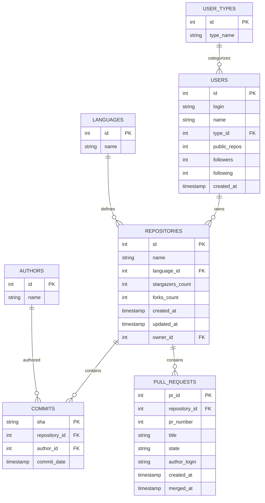

# 🎓 GitHub Students Insights

An end-to-end **Data Engineering & AI pipeline** that extracts GitHub activity data, loads it into **Snowflake**, and applies **Machine Learning models** to help academic mentors monitor student project progress — with final analytics delivered via an interactive **Streamlit Dashboard**.

---

## 🏗 Architecture

```
GitHub API  →  Extract (Python)  →  CSVs  →  Snowflake  →  Streamlit Dashboard
                                              ↓
                                         ML Models
```

| Stage | Tool | Description |
|---|---|---|
| **Extract** | Python + GitHub REST API | Deep-crawl user profiles, repos, commits, PRs |
| **Transform** | `normalize_data.py` | Flatten nested JSON into 7 normalized CSV tables |
| **Load** | Snowflake Connector | Auto-create schema & bulk-load CSVs into cloud warehouse |
| **Schedule** | Snowflake Tasks (CRON) | Automated data quality checks & analytics refresh |
| **Analyze & ML** | scikit-learn + Streamlit | Interactive dashboards for project grading, fatigue alerts, and PR predictions |

---

## 📊 Database Schema



---

## 🤖 Machine Learning Models

| Model | Algorithm | Purpose |
|---|---|---|
| **Student Fatigue Predictor** | Isolation Forest | Flags students at risk of burnout based on late-night & weekend commit patterns |
| **Submission Timeline Predictor** | Random Forest Regressor | Predicts how many days a PR will take to get reviewed and merged |
| **Project Progress Scorer** | K-Means Clustering | Grades projects from A (Excellent) to F (Stalled) based on activity & consistency |
| **Advanced Analytics** | Statistical Analysis | Collaboration scores, bus factor warnings, velocity tracking |

---

## 📁 Project Structure

```
Github-Students-Insights/
│
├── main.py                      # ETL orchestrator — entry point
├── config.py                    # Configuration & environment variables
├── requirements.txt             # Python dependencies
├── .env                         # Credentials (gitignored)
│
├── pipeline/                    # GitHub API extraction layer
│   ├── __init__.py
│   ├── client.py                # GitHub REST API client with retry & rate limiting
│   └── normalize_data.py        # JSON → 7 normalized CSV tables
│
├── snowflake/                   # Snowflake data warehouse layer
│   ├── load_to_snowflake.py     # Auto-creates DB, schema, tables & loads CSVs
│   ├── create_snowflake_views.py# Creates dashboard-ready views
│   ├── snowflake_ddl.sql        # Table definitions (DDL)
│   ├── snowflake_tasks.sql      # CRON-scheduled tasks for automated refresh
│   └── power_bi_views.sql       # View definitions for dashboards
│
├── ml/                          # Machine Learning models & reports
│   ├── train_suite.py           # Orchestrator — trains all models
│   ├── predict_burnout.py       # Student fatigue detection
│   ├── predict_pr_merge.py      # PR merge time prediction
│   ├── repo_health_score.py     # Project progress grading
│   └── advanced_analytics.py    # Collaboration & velocity analytics
│
├── dashboard/                   # Streamlit web dashboard
│   └── app.py                   # Mentor support interface
│
├── data/                        # Extracted data files (gitignored)
│   ├── github_raw_data.json     # Raw API responses
│   ├── commits.csv              # ~146K commits
│   ├── pull_requests.csv        # ~30K pull requests
│   ├── repositories.csv         # ~3.3K repositories
│   └── ...                      # users, authors, languages, user_types
│
└── docs/                        # Documentation
    ├── dashboard_layout_blueprint.md # Streamlit dashboard layout blueprint
    └── final_project_report.md  # Project report
```

---

## 🛠 Setup & Usage

### Prerequisites
- Python 3.10+
- GitHub Personal Access Token ([create one](https://github.com/settings/tokens))
- Snowflake Account (free trial works)

### Installation

```bash
pip install -r requirements.txt
```

### Configure `.env`

```env
GITHUB_TOKEN=your_github_token

SNOWFLAKE_USER=your_username
SNOWFLAKE_PASSWORD=your_password
SNOWFLAKE_ACCOUNT=your_account_identifier
SNOWFLAKE_WAREHOUSE=COMPUTE_WH
SNOWFLAKE_DATABASE=GITSTAR_DB
SNOWFLAKE_SCHEMA=PUBLIC
```

### Run the Pipeline

```bash
# Step 1: Extract data from GitHub → generates CSVs
python main.py

# Step 2: Load CSVs into Snowflake (auto-creates DB, schema & tables)
python snowflake/load_to_snowflake.py

# Step 3: Create dashboard-ready views in Snowflake
python snowflake/create_snowflake_views.py

# Step 4: Train ML models
cd ml && python train_suite.py && cd ..

# Step 5: Launch Mentor Dashboard
streamlit run dashboard/app.py
```

### Snowflake Scheduled Tasks
Run `snowflake/snowflake_tasks.sql` in your Snowflake worksheet to activate:
- **Daily** data quality checks (6 AM IST)
- **Every 6 hours** analytics cache refresh
- **Weekly** commit trend summaries (Monday 7 AM IST)

---

## 🎓 Mentor Dashboard

The Streamlit dashboard provides 6 interactive tabs:

| Tab | Feature |
|---|---|
| 📈 **Project Health Score** | AI-Clustered project health grades (A to D/F) based on activity and language distribution |
| 🚨 **Risk Watchlist** | Identifies high-risk projects and provides AI mentor diagnostics |
| 🤝 **Collaboration Index** | Work distribution metrics, contributor dependence, and inactivity warnings |
| 🔥 **Burnout Analysis** | Weekend/late-night work pattern anomaly detection |
| 🏆 **Project Ranking** | Batch-wide leaderboard sorting all projects by activity levels |
| ⏳ **Submission Predictor** | AI predictor for estimating PR review and merge durations |

---

**Built with ❤️ for academic mentors to effectively guide and monitor student projects.**
